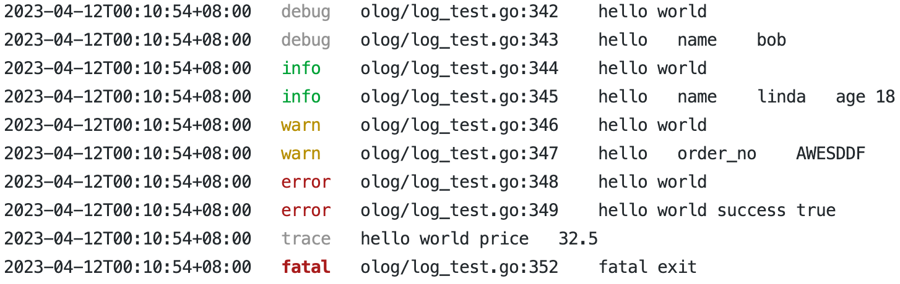

<p align="center">
    <br> <a href="README.md">English</a> | 中文
</p>

# olog
* olog是一个轻量级、高性能、开箱即用的日志库，完全依赖于Go标准库。
* 支持以JSON和纯文本格式输出日志。
* 支持设置上下文处理函数，以从上下文中检索字段以进行输出。
* 支持七个日志级别：TRACE、DEBUG、INFO、NOTICE、WARN、ERROR和FATAL，对应于“trace”、“debug”、“info”、“notice”、“warn”、“error”和“fatal”标签。用户还可以定义自己的语义标签，如“slow”和“stat”。
* 提供输出开关控制，除了FATAL之外的所有日志级别都可以控制输出。
* 增强了对调用者打印的控制。用户可以在全局设置中禁用调用者打印以提高性能，但可以在打印某些关键日志时启用调用者打印支持。
* 为用户提供了一个Logger接口，以便轻松构建自己的日志记录器。

### 代码示例
```go
    Trace("hello world")
    Tracew("hello", Field{Key: "name", Value: "bob"})
    Debug("hello world")
    Infow("hello", Field{Key: "name", Value: "linda"}, Field{Key: "age", Value: 18})
    Noticef("hello %s", "world")
    Warnf("hello %s", "world")
    Warnw("hello", Field{Key: "order_no", Value: "AWESDDF"})
    Errorw("hello world", Field{Key: "success", Value: true})
    Log(DEBUG, WithTag("print"), WithPrintMsg("hello world"), WithCaller(false),
        WithFields(Field{Key: "price", Value: 32.5}), WithCallStack(1))
    Fatal("fatal exit")
```
json输出如下：
```json
{"@timestamp":"2023-04-20T00:25:35+08:00","level":"trace","caller":"olog/log_test.go:377","content":"hello world","stack":"olog/log_test.go:377&github.com/welllog/olog.TestPlainOutput testing/testing.go:1576&testing.tRunner runtime/asm_arm64.s:1172&runtime.goexit"}
{"@timestamp":"2023-04-20T00:25:35+08:00","level":"trace","caller":"olog/log_test.go:378","content":"hello","name":"bob","stack":"olog/log_test.go:378&github.com/welllog/olog.TestPlainOutput testing/testing.go:1576&testing.tRunner runtime/asm_arm64.s:1172&runtime.goexit"}
{"@timestamp":"2023-04-20T00:25:35+08:00","level":"debug","caller":"olog/log_test.go:379","content":"hello world"}
{"@timestamp":"2023-04-20T00:25:35+08:00","level":"info","caller":"olog/log_test.go:380","content":"hello","name":"linda","age":18}
{"@timestamp":"2023-04-20T00:25:35+08:00","level":"notice","caller":"olog/log_test.go:381","content":"hello world"}
{"@timestamp":"2023-04-20T00:25:35+08:00","level":"warn","caller":"olog/log_test.go:382","content":"hello world"}
{"@timestamp":"2023-04-20T00:25:35+08:00","level":"warn","caller":"olog/log_test.go:383","content":"hello","order_no":"AWESDDF"}
{"@timestamp":"2023-04-20T00:25:35+08:00","level":"error","caller":"olog/log_test.go:384","content":"hello world","success":true}
{"@timestamp":"2023-04-20T00:25:35+08:00","level":"print","content":"hello world","price":32.5,"stack":"olog/log_test.go:385&github.com/welllog/olog.TestPlainOutput"}
{"@timestamp":"2023-04-20T00:25:35+08:00","level":"fatal","caller":"olog/log_test.go:387","content":"fatal exit"}
```
plain输出如下：


### contextLogger使用
```go
        SetDefCtxHandle(func(ctx context.Context) []Field {
		var fs []Field
		uid, ok := ctx.Value("uid").(int)
		if ok {
			fs = append(fs, Field{Key: "uid", Value: uid})
		}

		name, ok := ctx.Value("name").(string)
		if ok {
			fs = append(fs, Field{Key: "name", Value: name})
		}
		return fs
	})
        logger := WithContext(GetLogger(), context.WithValue(context.Background(), "uid", 3))
	logger.Debug("test")
		
        logger = WithContext(logger, context.WithValue(context.Background(), "name", "bob"))
        logger = WithEntries(logger, map[string]any{"requestId": "ae32fec"})
	logger.Debug("test 2")
```

### 实现自己的logger
```
type CustomLogger struct {
	Logger
}

func (l *CustomLogger) Slow(a ...any) {
	l.Log(WARN, WithPrint(a...), WithTag("slow"), WithCallerSkipOne)
}

func (l *CustomLogger) Stat(a ...any) {
	l.Log(INFO, WithPrint(a...), WithTag("stat"), WithCallerSkipOne)
}

func (l *CustomLogger) Debug(a ...any) {
	l.Log(DEBUG, WithPrint(a...), WithCallerSkipOne, WithCaller(true))
}
```

### 日志内容输出
目前日志内容默认输出到控制台。
如果需要输出内容到文件中，需要设置日志的Writer,可以通过将文件指针传递给NewWriter函数来构造一个Writer。
如果想要实现更强大的输出控制如切割日志文件,可以使用[github.com/lestrrat-go/file-rotatelogs](https://github.com/lestrrat-go/file-rotatelogs)来构造Writer。
自主实现Write方法时需要注意参数[]byte不应该超出该方法的作用域，否则可能会导致数据并发问题并导致混乱。

### 性能
记录一条消息和3个字段(禁用caller输出,并发测试)：
```
goos: darwin
goarch: arm64
pkg: github.com/welllog/olog
BenchmarkInfo
BenchmarkInfo/std.logger
BenchmarkInfo/std.logger-10         	 3740652	       284.4 ns/op	      48 B/op	       1 allocs/op
BenchmarkInfo/olog.json
BenchmarkInfo/olog.json-10          	14560014	        83.89 ns/op	      96 B/op	       1 allocs/op
BenchmarkInfo/olog.plain
BenchmarkInfo/olog.plain-10         	20607255	        58.84 ns/op	      96 B/op	       1 allocs/op
BenchmarkInfo/olog.ctx.json
BenchmarkInfo/olog.ctx.json-10      	 7297224	       150.4 ns/op	     376 B/op	       6 allocs/op
BenchmarkInfo/olog.ctx.plain
BenchmarkInfo/olog.ctx.plain-10     	 8775705	       134.7 ns/op	     376 B/op	       6 allocs/op
PASS
```