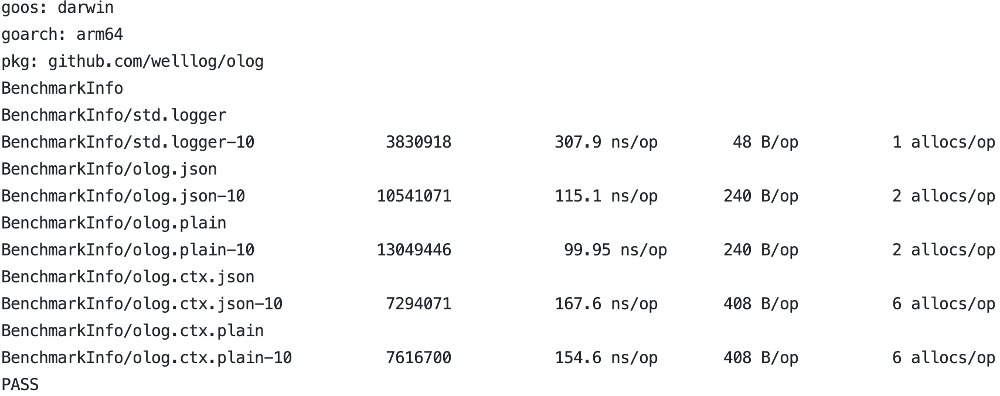

<p align="center">
    <br> English | <a href="README-CN.md">中文</a>
</p>

# olog
* olog is a lightweight, high-performance, out-of-the-box logging library that relies solely on the Go standard library.
* Supports outputting logs in both JSON and plain text formats.
* Supports setting context handling functions to retrieve fields from the context for output.
* Supports five log levels: DEBUG, INFO, WARN, ERROR, and FATAL, corresponding to the "debug", "info", "warn", "error", and "fatal" tags. Users can also define their own semantic tags, such as "slow" and "stat".
* Provides output switch control for all log levels except FATAL.
* Enhances control over caller printing. Users can disable caller printing in global settings to improve performance, but can enable support for caller printing when printing certain critical logs.
* Provides a Logger interface for users to easily construct their own logger.

### code example
```go
    Debug("hello world")
    Debugw("hello", Field{Key: "name", Value: "bob"})
    Info("hello world")
    Infow("hello", Field{Key: "name", Value: "linda"}, Field{Key: "age", Value: 18})
    Warnf("hello %s", "world")
    Warnw("hello", Field{Key: "order_no", Value: "AWESDDF"})
    Error("hello world")
    Errorw("hello world", Field{Key: "success", Value: true})
    Log(DEBUG, WithTag("trace"), WithPrintMsg("hello world"), WithCaller(false),
        WithFields(Field{Key: "price", Value: 32.5}))
    Fatal("fatal exit")
```
The json output is as follows:
```json
{"@timestamp":"2023-04-11T16:54:19+08:00","level":"debug","caller":"olog/log_test.go:501","content":"hello world"}
{"@timestamp":"2023-04-11T16:54:19+08:00","level":"debug","caller":"olog/log_test.go:502","content":"hello","name":"bob"}
{"@timestamp":"2023-04-11T16:54:19+08:00","level":"info","caller":"olog/log_test.go:503","content":"hello world"}
{"@timestamp":"2023-04-11T16:54:19+08:00","level":"info","caller":"olog/log_test.go:504","content":"hello","name":"linda","age":18}
{"@timestamp":"2023-04-11T16:54:19+08:00","level":"warn","caller":"olog/log_test.go:505","content":"hello world"}
{"@timestamp":"2023-04-11T16:54:19+08:00","level":"warn","caller":"olog/log_test.go:506","content":"hello","order_no":"AWESDDF"}
{"@timestamp":"2023-04-11T16:54:19+08:00","level":"error","caller":"olog/log_test.go:507","content":"hello world"}
{"@timestamp":"2023-04-11T16:54:19+08:00","level":"error","caller":"olog/log_test.go:508","content":"hello world","success":true}
{"@timestamp":"2023-04-11T16:54:19+08:00","level":"trace","content":"hello world","price":32.5}
{"@timestamp":"2023-04-11T16:54:19+08:00","level":"fatal","caller":"olog/log_test.go:511","content":"fatal exit"}
```
The plain output is as follows:


### contextLogger uses
```go
    SetDefCtxHandle(func(ctx context.Context) []Field {
		var fs []Field
		uid, ok := ctx.Value("uid").(int)
		if ok {
			fs = append(fs, Field{Key: "uid", Value: uid})
		}

		name, ok := ctx.Value("name").(string)
		if ok {
			fs = append(fs, Field{Key: "name", Value: name})
		}
		return fs
	})

    logger := WithContext(GetLogger(), context.WithValue(context.Background(), "uid", 3))
	logger.Debug("test")
	
	logger = WithContext(logger, context.WithValue(context.Background(), "name", "bob"))
	logger.Debug("test 2")
```

### Implement your own logger
```
type CustomLogger struct {
	Logger
}

func (l *CustomLogger) Slow(a ...any) {
	l.Log(WARN, WithPrint(a...), WithTag("slow"), WithCallerSkipOne)
}

func (l *CustomLogger) Stat(a ...any) {
	Log(INFO, WithPrint(a...), WithTag("stat"), WithCallerSkipOne)
}

func (l *CustomLogger) Debug(a ...any) {
	Log(DEBUG, WithPrint(a...), WithCallerSkipOne, WithCaller(true))
}
```

### Log Content Output
Currently, log content is output to the console by default. 
To output content to a file, you need to set the log's Writer by constructing a Writer with the NewWriter function and passing a file pointer.
If you want to implement more powerful output control, such as log file splitting, you can use [github.com/lestrrat-go/file-rotatelogs](https://github.com/lestrrat-go/file-rotatelogs) to construct a Writer.
When implementing the Write method on your own, it is important to note that the []byte parameter should not exceed the scope of the method, otherwise data concurrency issues may occur and result in confusion.

### Performance
Log a message and 3 fields(disable caller output and RunParallel):

